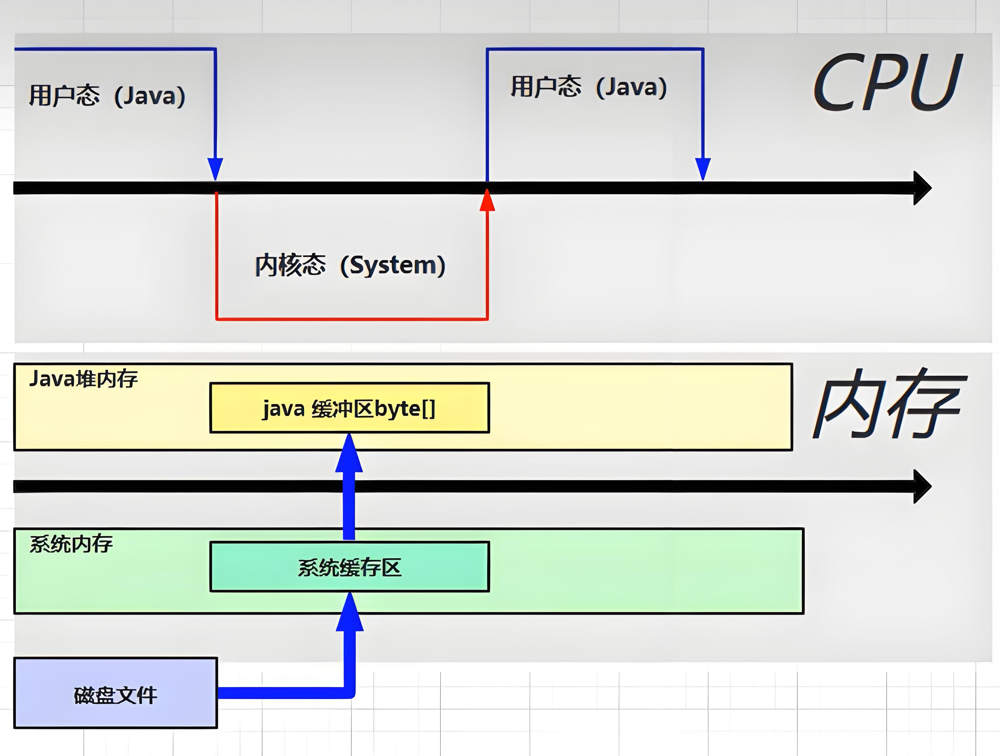
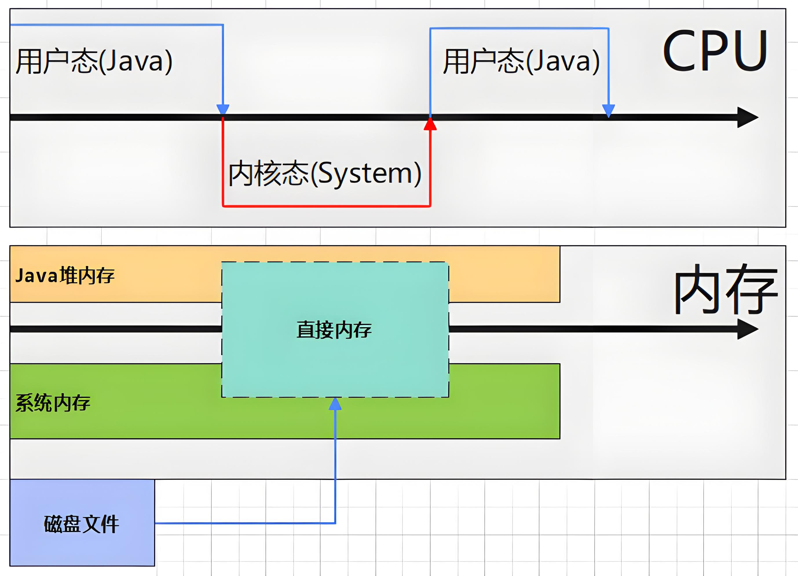

# Java 网络编程

[](https://www.oracle.com/java/)
[](https://maven.apache.org/)
[](LICENSE)

一个完整的 Java 网络编程学习项目，涵盖 BIO、NIO、AIO 三种 I/O 模型，以及回调模式示例

## 📋 目录

- [Java 网络编程](#java-网络编程)
  - [📋 目录](#-目录)
  - [项目简介](#项目简介)
  - [技术栈](#技术栈)
  - [项目结构](#项目结构)
  - [模块说明](#模块说明)
    - [BIO (Blocking I/O)](#bio-blocking-io)
    - [NIO (Non-blocking I/O)](#nio-non-blocking-io)
    - [AIO (Asynchronous I/O)](#aio-asynchronous-io)
    - [回调模式示例](#回调模式示例)
  - [快速开始](#快速开始)
    - [环境要求](#环境要求)
    - [编译项目](#编译项目)
    - [运行测试](#运行测试)
  - [运行示例](#运行示例)
    - [TCP 通信示例](#tcp-通信示例)
    - [UDP 通信示例](#udp-通信示例)
    - [NIO 聊天室示例](#nio-聊天室示例)
  - [图示说明](#图示说明)
    - [堆内缓冲区 (Heap Buffer)](#堆内缓冲区-heap-buffer)
    - [直接缓冲区 (Direct Buffer)](#直接缓冲区-direct-buffer)
  - [核心概念对比](#核心概念对比)
  - [配置说明](#配置说明)
  - [常见问题 (FAQ)](#-常见问题-faq)
  - [学习资源推荐](#-学习资源推荐)
  - [贡献](#贡献)
  - [许可证](#许可证)

## 项目简介

本项目通过实际的代码示例，演示 Java 中三种不同的 I/O 编程模型：

| I/O 模型  |      特点      |     适用场景      |
|:-------:|:------------:|:-------------:|
| **BIO** | 阻塞式，一个连接一个线程 |  连接数较少且固定的场景  |
| **NIO** |   非阻塞，多路复用   | 连接数多但连接时间短的场景 |
| **AIO** |    异步非阻塞     | 连接数多且连接时间长的场景 |

## 技术栈

- **Java 8** - 核心编程语言
- **Maven** - 构建工具
- **Lombok** - 简化代码
- **SLF4J + Logback** - 日志框架

## 项目结构

```
network-programming/
├── pom.xml                           # Maven 配置文件
├── README.md                         # 项目说明文档
├── LICENSE                           # 许可证文件
└── src/
    └── main/
        ├── java/                     # Java 源代码
        │   ├── aio/                  # 异步 I/O (AIO)
        │   │   ├── Client.java
        │   │   └── Server.java
        │   ├── bio/                  # 阻塞 I/O (BIO)
        │   │   ├── tcp/              # TCP 通信
        │   │   │   ├── Client.java
        │   │   │   ├── MultiThreadServer.java
        │   │   │   └── SingleThreadServer.java
        │   │   └── udp/              # UDP 通信
        │   │       ├── Client.java
        │   │       └── Server.java
        │   ├── callback/             # 回调模式示例
        │   │   ├── AsyncCalculator.java
        │   │   ├── Client.java
        │   │   └── ResultCallback.java
        │   ├── nio/                  # 非阻塞 I/O (NIO)
        │   │   ├── tcp/              # TCP 聊天室
        │   │   │   ├── Client.java
        │   │   │   ├── Client1.java
        │   │   │   ├── Client2.java
        │   │   │   └── Server.java
        │   │   └── udp/              # UDP 通信
        │   │       ├── Client.java
        │   │       └── Server.java
        │   └── util/                 # 工具类
        │       ├── NetworkConfig.java
        │       ├── TCPUtil.java
        │       └── UDPUtil.java
        └── resources/                # 资源文件
            ├── image/                # 图片资源
            │   ├── 堆内缓冲区.jpeg
            │   └── 直接缓冲区.jpeg
            └── logback.xml           # 日志配置文件
```

## 模块说明

### BIO (Blocking I/O)

传统的阻塞式 I/O 模型，每个连接都需要一个独立的线程处理

**特点**：
- 代码简单直观
- 线程开销大
- 适合连接数少的场景

**运行方式**：
```bash
# 1. 启动服务端（选择一个）
mvn exec:java -Dexec.mainClass="bio.tcp.SingleThreadServer"
mvn exec:java -Dexec.mainClass="bio.tcp.MultiThreadServer"

# 2. 启动客户端
mvn exec:java -Dexec.mainClass="bio.tcp.Client"
```

### NIO (Non-blocking I/O)

基于 Channel、Buffer、Selector 的非阻塞 I/O 模型

**特点**：
- 单线程处理多连接
- 使用缓冲区提高性能
- 适合高并发场景

**聊天室示例**：
```bash
# 1. 启动服务端
mvn exec:java -Dexec.mainClass="nio.tcp.Server"

# 2. 启动多个客户端
mvn exec:java -Dexec.mainClass="nio.tcp.Client1"
mvn exec:java -Dexec.mainClass="nio.tcp.Client2"
```

**UDP 通信示例**：
```bash
# 1. 启动服务端
mvn exec:java -Dexec.mainClass="nio.udp.Server"

# 2. 启动客户端
mvn exec:java -Dexec.mainClass="nio.udp.Client"
```

**核心组件**：
| 组件 | 说明 |
|:---:|:---:|
| `Selector` | 多路复用器，用于轮询 Channel 上的事件 |
| `Channel` | 双向通道，可读可写 |
| `Buffer` | 数据容器，读写数据的中转站 |
| `DatagramChannel` | UDP 数据报通道 |

### AIO (Asynchronous I/O)

JDK 7 引入的异步 I/O，基于回调机制

**特点**：
- 真正的异步非阻塞
- 通过 CompletionHandler 处理结果
- 适合高并发、长连接场景

**运行方式**：
```bash
# 1. 启动服务端
mvn exec:java -Dexec.mainClass="aio.Server"

# 2. 启动客户端
mvn exec:java -Dexec.mainClass="aio.Client"
```

**核心组件**：
| 组件 | 说明 |
|:---:|:---:|
| `AsynchronousServerSocketChannel` | 异步服务端 Socket 通道 |
| `AsynchronousSocketChannel` | 异步客户端 Socket 通道 |
| `CompletionHandler` | 异步操作完成后的回调处理器 |

### 回调模式示例

演示异步编程中的回调模式，实现计算与结果处理的解耦。

**文件说明**：

|           文件           |          说明           |
|:----------------------:|:---------------------:|
| `AsyncCalculator.java` | 异步计算器，执行耗时计算并通过回调返回结果 |
| `ResultCallback.java`  |   回调接口，定义计算完成后的处理逻辑   |
|     `Client.java`      |    使用示例，演示如何使用回调模式    |

```java
public class Client {
    static void main(String[] args) {
        AsyncCalculator calculator = new AsyncCalculator();
        calculator.run(1, 2, result -> System.out.println("计算结果: " + result));
    }
}
```

## 快速开始

### 环境要求

- JDK 8 或更高版本
- Maven 3.6 或更高版本

### 编译项目

```bash
mvn clean compile
```

### 运行测试

```bash
mvn test
```

## 运行示例

### TCP 通信示例

```bash
# 终端 1 - 启动服务端
mvn exec:java -Dexec.mainClass="bio.tcp.SingleThreadServer"

# 终端 2 - 启动客户端
mvn exec:java -Dexec.mainClass="bio.tcp.Client"
```

### UDP 通信示例

```bash
# 终端 1 - 启动服务端
mvn exec:java -Dexec.mainClass="bio.udp.Server"

# 终端 2 - 启动客户端
mvn exec:java -Dexec.mainClass="bio.udp.Client"
```

### NIO 聊天室示例

```bash
# 终端 1 - 启动聊天室服务端
mvn exec:java -Dexec.mainClass="nio.tcp.Server"

# 终端 2 - 启动客户端 1（小明）
mvn exec:java -Dexec.mainClass="nio.tcp.Client1"

# 终端 3 - 启动客户端 2（小赵）
mvn exec:java -Dexec.mainClass="nio.tcp.Client2"
```

## 图示说明

### 堆内缓冲区 (Heap Buffer)

数据存储在 JVM 堆内存中，创建和销毁速度快，但数据复制到 Native 内存时会有性能开销



### 直接缓冲区 (Direct Buffer)

数据存储在 Native 内存中，避免了数据拷贝，适合频繁的 I/O 操作，但创建和销毁成本较高



## 核心概念对比

|     特性      |     BIO     |        NIO        |  AIO  |
|:-----------:|:-----------:|:-----------------:|:-----:|
|  **线程模型**   | 1:1 (连接:线程) | 1:N (Selector:连接) | 回调驱动  |
|   **阻塞性**   |     阻塞      |        非阻塞        | 异步非阻塞 |
| **API 复杂度** |     简单      |        中等         |  中等   |
|   **吞吐量**   |      低      |         高         |   高   |
|   **延迟**    |      高      |         低         |   低   |
| **JDK 版本**  |    1.0+     |       1.4+        | 1.7+  |

## 配置说明

网络配置位于 `src/main/java/util/NetworkConfig.java`：

```java
public class NetworkConfig {
    public static final String HOST = "127.0.0.1";    // 服务端地址
    public static final int PORT = 9000;               // 服务端端口
    public static final int BUFFER_SIZE = 1024;        // 缓冲区大小
}
```

## ❓ 常见问题 (FAQ)

### 1. BIO、NIO、AIO 有什么区别？

| 对比项  |   BIO   |   NIO    |   AIO    |
|:----:|:-------:|:--------:|:--------:|
| 阻塞方式 |   阻塞    |   非阻塞    |  异步非阻塞   |
| 线程模型 | 一连接一线程  | 一线程处理多连接 |   回调驱动   |
| 适用场景 | 连接数少且固定 | 连接数多但时间短 | 连接数多且时间长 |

### 2. TCP 和 UDP 如何选择？

|   协议    |     特点      |     适用场景     |
|:-------:|:-----------:|:------------:|
| **TCP** | 可靠传输、有序、有连接 | 文件传输、邮件、网页浏览 |
| **UDP** | 不可靠、无连接、速度快 | 视频直播、DNS、游戏  |

### 3. 运行时提示端口被占用怎么办？

修改 `NetworkConfig.java` 中的 `PORT` 值，或终止占用端口的进程：

```bash
# Windows 查看端口占用
netstat -ano | findstr :9000

# 终止进程 (PID 为上一步查到的进程ID)
taskkill /PID <进程ID> /F
```

### 4. 为什么 NIO 示例中客户端连接后没有反应？

确保先启动服务端，再启动客户端。NIO 是非阻塞的，客户端连接需要服务端先监听。

### 5. 堆内缓冲区和直接缓冲区如何选择？

|        类型         |     优点     |    缺点     |     适用场景     |
|:-----------------:|:----------:|:---------:|:------------:|
|  **Heap Buffer**  | 创建快、GC 管理  | I/O 需要复制  |  短生命周期、数据量小  |
| **Direct Buffer** | 零拷贝、I/O 高效 | 创建慢、需手动释放 | 长生命周期、频繁 I/O |

## 📚 学习资源推荐

### 官方文档
- [Java Networking](https://docs.oracle.com/javase/tutorial/networking/)
- [Java NIO](https://docs.oracle.com/javase/8/docs/api/java/nio/package-summary.html)

### 推荐书籍
- 《Java 网络编程》- Elliotte Rusty Harold
- 《Java NIO》- Ron Hitchens
- 《Netty 权威指南》- 李林锋

### 相关项目
- [Netty](https://github.com/netty/netty) - 异步事件驱动网络框架
- [Mina](https://github.com/apache/mina) - Apache 网络应用框架

## 贡献

欢迎提交 Issue 和 Pull Request

## 许可证

本项目采用 [MIT License](LICENSE) 开源许可证
